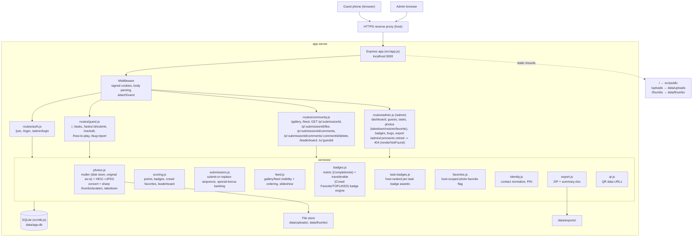

# Architecture

How a request travels through Wedding Master, and how the data is shaped. For the reasoning behind these choices see [`DESIGN.md`](../DESIGN.md).

**A note on scope:** the scoring/badge model below is the settled, shipped design — the authority for _why_ it pays the way it does is [`docs/game-design-points-badges.md`](game-design-points-badges.md), whose nine point sources are all implemented in `src/services/scoring.js`. One piece of the pre-settlement model is still live and pending removal: `guests.bonus_points` (a freeform admin award with no task/photo/reason attached) — see [Deprecated](#deprecated--the-previous-scoringbadge-system) for its status.

## Request path

A guest's phone and the admin's browser both reach the app server through a reverse proxy that terminates HTTPS, which forwards to Express. `src/app.js` runs the request through middleware, into a router, which calls services that read and write SQLite and the file store under `data/`.



`app.js` mounts the routers in a deliberate order: `auth.js` and `admin.js` (at `/admin`) before `guest.js`, because `guest.js` applies `requireGuest` to everything under `/` and would otherwise intercept `/admin` and redirect the admin to `/join` instead of serving the admin dashboard (issue #241 changed `requireGuest` from a 403 message card to a `/join` redirect). It also creates the `data/` directories on boot and registers the 404 and error handlers last.

## Data model

Eleven tables (`src/db.js`, both the top `CREATE TABLE IF NOT EXISTS` block and the guarded migrations below it — a fresh database gets all eleven directly; an existing one is walked up to the same shape by the migration functions). One retired table, `badge_winners`, is dropped outright by a guarded migration (`ensureBadgeWinnersTableDropped`, issue #661) and no longer exists on any database this app boots. Several UNIQUE constraints and one CHECK-enforced pairing carry the core game rules. One field, `guests.bonus_points`, belongs to the pre-settlement scoring model and is pending removal — see [Deprecated](#deprecated--the-previous-scoringbadge-system).

```mermaid
erDiagram
    guests ||--o{ submissions : "submits"
    tasks ||--o{ submissions : "completed by (task_id nullable — NULL is a memory, #247)"
    tasks ||--o{ badges : "task-badge link (badges.task_id nullable, partial unique)"
    guests ||--o{ guest_badges : "earns"
    badges ||--o{ guest_badges : "awarded as"
    submissions ||--o{ guest_badges : "earning photo (submission_id nullable)"
    guests ||--o{ likes : "likes"
    submissions ||--o{ likes : "liked by"
    guests ||--o{ comments : "comments"
    submissions ||--o{ comments : "commented on"
    guests ||--o{ bug_reports : "files"
    submissions ||--o{ admin_favorites : "favorited as"
    guests ||--o{ notification_events : "notified"
    submissions ||--o{ notification_events : "about (nullable)"
    badges ||--o{ notification_events : "about (nullable)"

    guests {
        int id PK
        text token UK "internal session credential, never distributed"
        text name
        text avatar_path
        text social_links "JSON"
        int bonus_points "admin freeform award, still live — pending removal (#683)"
        int onboarded "0 until GET /how-to-play renders once for this guest"
        text contact "normalized email or phone"
        text contact_type "email | phone"
        text pin "4-digit re-entry PIN, plaintext"
        int pinned "hoists guest's gallery section"
        text recap_checked_at "recap checkpoint; NULL = never checked"
        text created_at
    }
    tasks {
        int id PK
        text title
        text description
        int sort_order
        int worth "host-chosen 1-3, points a completed task pays (#727); replaced the old is_active flag as the task's stored value"
        text special_mode "none | hidden | oneday - sole owner of task liveness (hidden = off)"
        text special_date "one-day-only challenge date YYYY-MM-DD; paired with special_bonus (#753)"
        int special_bonus "1-3, one-day-only on-day bonus; NULL iff special_date is NULL"
        text flash_start_at "flash window start, ISO instant (#761)"
        int flash_minutes "flash window duration, minutes"
        int flash_bonus "1-3, flash-window bonus"
        text lucky_date "lucky-task date YYYY-MM-DD (#650) - deliberately NO special_mode member"
        int lucky_bonus "1-3, secret lucky first-completion bonus"
        text live_since "instant task last flipped not-live -> live; NULL = never live (#778)"
        text created_at
    }
    submissions {
        int id PK
        int guest_id FK
        int task_id FK "nullable — NULL is a memory (#247)"
        text photo_path
        text thumb_path
        text caption
        int taken_down
        int resubmitted "1 = guest replaced this while taken_down (issue #190)"
        int photo_bonus "admin per-photo bonus, still live"
        int bonus_amount "banked special (oneday/flash/lucky) bonus, at submit time (#753)"
        text bonus_reason "oneday | flash | lucky | NULL"
        text created_at
    }
    badges {
        int id PK
        text code UK
        text name
        text type "auto | special | metric | transferable | custom - all five live"
        int threshold
        text art_path
        text description
        int task_id FK "nullable — task-badge link; partial UNIQUE (#483)"
    }
    guest_badges {
        int id PK
        int guest_id FK
        int badge_id FK
        text awarded_by "system | admin"
        int points "points this held badge is worth (#709)"
        text note
        int submission_id FK "nullable — earning photo for a task-badge award (#483)"
        text celebrated_at "NULL = celebration owed (#644)"
        int rank "1-5 for a ranked task-badge release, else NULL (#661)"
        text created_at
    }
    likes {
        int id PK
        int submission_id FK
        int guest_id FK
        text created_at
    }
    comments {
        int id PK
        int submission_id FK
        int guest_id FK
        text body
        int taken_down
        text created_at
    }
    bug_reports {
        int id PK
        int guest_id FK
        text body
        text page
        text user_agent
        int resolved "retired (#686) - status below is the single lifecycle fact"
        text status "open | tracked | closed"
        text created_at
    }
    admin_favorites {
        int id PK
        int submission_id FK UK "host-scoped favorite flag; row presence IS the favorite (#259)"
        text created_at
    }
    notification_events {
        int id PK
        int guest_id FK
        text kind "badge_granted | badge_revoked | badge_removed | photo_takedown | photo_restore | comment_hidden | comment_restored"
        int submission_id FK "nullable"
        int badge_id FK "nullable"
        text created_at
    }
    settings {
        text key PK
        text value
    }
```

UNIQUE constraints:

- `submissions UNIQUE(guest_id, task_id)` — one submission per guest per real task. SQLite treats every NULL as distinct under UNIQUE, so a guest may hold any number of `task_id = NULL` memory rows alongside at most one row per real task.
- `guest_badges UNIQUE(guest_id, badge_id)` — a guest holds each badge at most once, making re-scoring and re-awarding idempotent.
- `likes UNIQUE(submission_id, guest_id)` — a guest can like a given photo at most once; the like route toggles this row.
- `guests` partial unique index on `contact` (`WHERE contact IS NOT NULL`) — two guests cannot share a normalized contact.
- `badges` partial unique index on `task_id` (`WHERE task_id IS NOT NULL`) — a task has at most one badge row (#483).
- `admin_favorites.submission_id` UNIQUE — a submission is favorited at most once; the toggle route is an idempotent insert-or-delete.
- `tasks CONSTRAINT chk_special_pairing CHECK ((special_date IS NULL) = (special_bonus IS NULL))` — a one-day-only challenge is never half-set.

`submissions` and `guest_badges` reference `guests(id)` and their parent (`tasks`/`badges`/`submissions`) with `ON DELETE CASCADE`; `badges.task_id`, `likes`, `comments`, `admin_favorites`, and `notification_events` reference their parents the same way; `bug_reports` references `guests(id)` the same way. Foreign keys are enforced (`PRAGMA foreign_keys = ON` in `src/db.js`).

## Walkthrough: a photo upload

1. A signed-in guest opens a task at `GET /tasks/:id`. The `attachGuest` middleware has already read the signed `gsid` cookie and loaded the guest onto `res.locals`; `requireGuest` confirms a guest is present.
2. The guest submits the form to `POST /tasks/:id/submit` as `multipart/form-data`. `guest.js` hands the upload to `services/photos.js`: multer's disk storage writes the original to `data/uploads/` as-is, under a random filename. A HEIC/HEIF photo (sniffed by file signature, not declared mimetype) is converted to JPEG separately at intake, in a worker thread — sharp itself never touches the original; it only builds the thumbnail (`makeThumb`, width `THUMB_WIDTH`, honoring EXIF rotation) written to `data/thumbs/`.
3. A `submissions` row is inserted with the guest id, task id, photo and thumb paths, and any caption. The `UNIQUE(guest_id, task_id)` constraint prevents a second submission for the same task.
4. `services/scoring.js` recomputes the guest's completed-task count (non-taken-down submissions). If the count crossed a `BADGE_THRESHOLDS` boundary (5 / 10 / 15), the matching auto badge is recorded in `guest_badges` with `awarded_by = 'system'`; `UNIQUE(guest_id, badge_id)` makes this safe to repeat.
5. The guest is redirected back, the photo now counts toward the task's point worth (host-set per `docs/game-design-points-badges.md`), appears in `/gallery`, on the guest's profile, and affects the leaderboard.

If the admin later takes the photo down, the row's `taken_down` flips to 1: the photo drops out of the gallery, profiles, and scoring, and can be restored later. The takedown is sticky (issue #190): if the guest resubmits the same task while it is still taken down, the photo is replaced in place but `taken_down` stays 1 — a resubmit no longer un-hides it — and `resubmitted` flips to 1 so `/admin/photos` flags a decision waiting. Restoring the submission clears both `taken_down` and `resubmitted`.

## Walkthrough: a sign-in

Every guest gets the SAME link — one QR poster (`GET /admin/poster`), printed once instead of a hundred personal place-cards — pointing at `GET /join` (issue #240; issue #244 retired the older per-guest personal-link scheme entirely).

1. A guest scans the poster's QR code, landing on `GET /join`. The form collects a name, an email-or-phone contact, and a self-chosen 4-digit re-entry PIN, plus an optional avatar — signup IS onboarding here, there is no separate onboarding step afterward.
2. `POST /join` normalizes the contact and validates the PIN shape (`services/identity.js`), checks `getGuestByContact` for an existing account under that contact so the same person cannot create a second guest row, and otherwise inserts a new `guests` row — `onboarded` is deliberately not named in that INSERT, so it takes the schema's `0` default — with a fresh token from `makeUniqueToken()` (also in `services/identity.js`). The token is written straight into the signed `gsid` cookie and never shown to the guest — it is an internal session credential, not a link anyone reads or copies. Because `onboarded = 0`, the guest is redirected to `/how-to-play`, not `/`; `GET /how-to-play` (`src/routes/guest.js`) is the only writer that ever flips `onboarded` to 1, and only on that page's actual render (issue #564) — a guest who never sees the page is shown the rules again next login.
3. A contact that already has an account is redirected to `/login` (issue #241) to re-enter with their contact + PIN on any device instead — `POST /login` looks the guest up by contact, checks the PIN, and on a match sets the same signed `gsid` cookie.
4. On every later request, `attachGuest` reads and verifies the signed `gsid` cookie, loads the guest by token, and exposes it to routes and views. The cookie signature (via `cookie-parser` and `COOKIE_SECRET`) is what makes the token tamper-evident.

The admin sign-in is parallel: `POST /admin/login` checks the submitted password against the bcrypt hash in `data/admin.hash`, and on success sets the signed `admin` cookie that `requireAdmin` checks for every `/admin` route.

## Deprecated — the previous scoring/badge system

This is how scoring and badges used to work, before the settled design in `docs/game-design-points-badges.md` landed. Two of the three retirement issues this section used to track are done; one is still open, pending an owner decision.

- **`submissions.photo_bonus`** — landed (#684, closed): the admin per-photo route (`POST /admin/photos/:id/points`) is retired, registered to `renderNotFound` so a stale bookmark 404s instead of falling through. The column itself is kept (dropping it would be a table rebuild for no behavioral gain) and its value still counts in `scoring.getPoints()`/`leaderboard()` as a remnant term for any value a pre-#684 admin already set — but nothing can write a new one.
- **`badges.type` collision codes `SHUTTERBUG`, `CROWDFAV`, `CHOICE`** — landed (#661, closed): these three catalog rows collided in name only with the old give-a-badge photo-winner picker (a separate `badge_winners` table, unrelated to `guest_badges`). Issue #661's one-badge-system consolidation deleted the picker, its table, and these three collision rows outright (`ensureSpecialBadgeCollisionsRemoved`, `ensureBadgeWinnersTableDropped`). `badges.type` values `special` and `metric` did **not** die with #661 — they remain live catalog kinds: `special` is still the admin hand-award type (EARLYBIRD is the current seeded example; `POST /admin/guests/:id/badge`), and `metric` still drives COMPLETIONIST (computed by `src/services/badges.js`'s `isCompletionist`). `transferable` also remains live, now backing TOPLIKED ("Crowd Favorite").
- **`guests.bonus_points`** — **still open, pending an owner decision (#683)**: a freeform point total an admin can add to or subtract from a guest directly, with no task, photo, or reason attached (`POST /admin/guests/:id/points`, `scoring.addBonusPoints`). Unlike the two items above, this one has not landed — the route is still live and the value still counts in `getPoints()`/`leaderboard()`. Do not resolve or build against an assumption about its outcome; #683 is deliberately left open for the owner to decide.
- **The flat "+1 point per task" model** — retired (#727 and the game-design settlement): every task now pays its host-chosen 1–3 point `worth`, plus up to eight further point sources (daily/flash/lucky bonus, memory-of-the-day, profile-photo starter, held-badge points, ranked task-badge awards, crowd-favorite rank) — see `docs/game-design-points-badges.md` for the full list and `scoring.getPoints()`/`scoring.leaderboard()` for the implementation.
