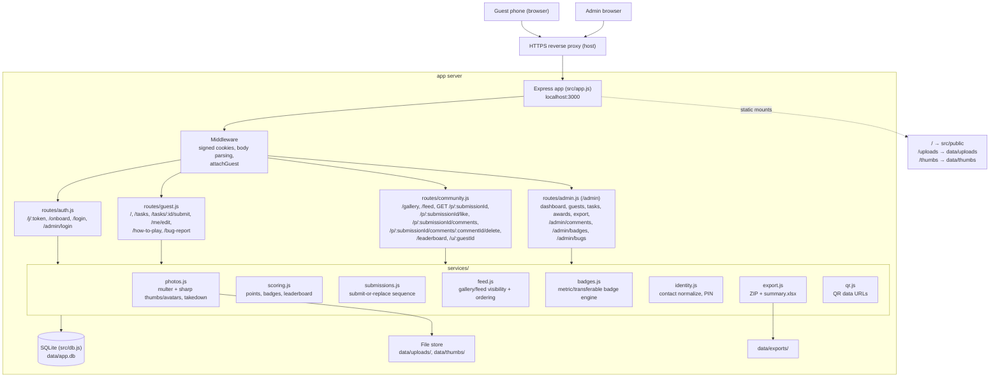
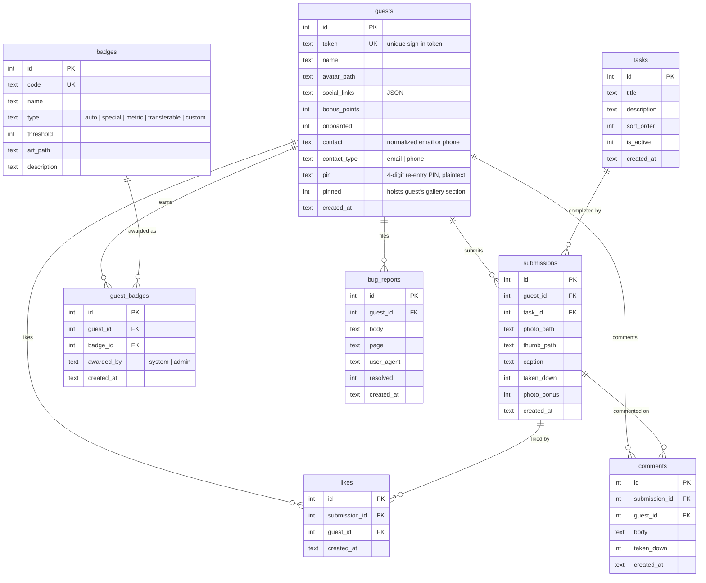

# Architecture

How a request travels through Garden Party Pastels, and how the data is shaped. For the reasoning behind these choices see [`DESIGN.md`](../DESIGN.md).

## Request path

A guest's phone and the admin's browser both reach the app server through a reverse proxy that terminates HTTPS, which forwards to Express. `src/app.js` runs the request through middleware, into a router, which calls services that read and write SQLite and the file store under `data/`.

`app.js` mounts the routers in a deliberate order: `auth.js` and `admin.js` (at `/admin`) before `guest.js`, because `guest.js` applies `requireGuest` to everything under `/` and would otherwise intercept `/admin` and redirect the admin to `/join` instead of serving the admin dashboard (issue #241 changed `requireGuest` from a 403 message card to a `/join` redirect). It also creates the `data/` directories on boot and registers the 404 and error handlers last.

## Data model

Eight tables. Several UNIQUE constraints carry the core game rules.

UNIQUE constraints:

- `submissions UNIQUE(guest_id, task_id)` — one submission per guest per task. A task cannot be completed twice, so it cannot be double-scored.
- `guest_badges UNIQUE(guest_id, badge_id)` — a guest holds each badge at most once, making re-scoring and re-awarding idempotent.
- `likes UNIQUE(submission_id, guest_id)` — a guest can like a given photo at most once; the like route toggles this row.
- `guests` partial unique index on `contact` (`WHERE contact IS NOT NULL`) — two guests cannot share a normalized contact.

`submissions` and `guest_badges` reference `guests(id)` and their parent (`tasks`/`badges`) with `ON DELETE CASCADE`; `likes` and `comments` reference `submissions(id)` and `guests(id)` the same way; `bug_reports` references `guests(id)` the same way. Foreign keys are enforced (`PRAGMA foreign_keys = ON` in `src/db.js`).

## Walkthrough: a photo upload

1. A signed-in guest opens a task at `GET /tasks/:id`. The `attachGuest` middleware has already read the signed `gsid` cookie and loaded the guest onto `res.locals`; `requireGuest` confirms a guest is present.
2. The guest submits the form to `POST /tasks/:id/submit` as `multipart/form-data`. `guest.js` hands the upload to `services/photos.js`, where multer accepts the file and sharp writes a normalized original to `data/uploads/` and a thumbnail (width `THUMB_WIDTH`) to `data/thumbs/`.
3. A `submissions` row is inserted with the guest id, task id, photo and thumb paths, and any caption. The `UNIQUE(guest_id, task_id)` constraint prevents a second submission for the same task.
4. `services/scoring.js` recomputes the guest's completed-task count (non-taken-down submissions). If the count crossed a `BADGE_THRESHOLDS` boundary (5 / 10 / 15), the matching auto badge is recorded in `guest_badges` with `awarded_by = 'system'`; `UNIQUE(guest_id, badge_id)` makes this safe to repeat.
5. The guest is redirected back, the photo now counts for a point, appears in `/gallery`, on the guest's profile, and affects the leaderboard.

If the admin later takes the photo down, the row's `taken_down` flips to 1: the photo drops out of the gallery, profiles, and scoring, and can be restored later.

## Walkthrough: a sign-in

1. A guest scans the QR code on their place-card, which opens `GET /j/:token` (the token is the random value from `guests.token`).
2. `routes/auth.js` looks up the guest by token (`getGuestByToken` in `src/db.js`). On a match it sets the signed `gsid` cookie carrying the token.
3. If the guest has not finished onboarding (`onboarded = 0`), they are sent to `/onboard` to set a name and avatar, which on completion redirects to a one-time `/how-to-play?first=1` rules card (issue #246) before the guest home; an already-onboarded guest lands on the guest home at `/` directly.
4. On every later request, `attachGuest` reads and verifies the signed `gsid` cookie, loads the guest, and exposes it to routes and views. The cookie signature (via `cookie-parser` and `COOKIE_SECRET`) is what makes the token tamper-evident.

The admin sign-in is parallel: `POST /admin/login` checks the submitted password against the bcrypt hash in `data/admin.hash`, and on success sets the signed `admin` cookie that `requireAdmin` checks for every `/admin` route.

### Shared entry link: self-serve signup at /join

Issue #240 adds a second, guest-facing way in that does not depend on a private per-guest token at all. Every guest gets the SAME link (QR poster, email, or place card) pointing at `GET /join`. The form collects a name, an email-or-phone contact, and a self-chosen 4-digit re-entry PIN, plus an optional avatar — signup IS onboarding here, so there is no separate `/onboard` step afterward. `POST /join` normalizes the contact and validates the PIN shape (`services/identity.js`), checks `getGuestByContact` for an existing account under that contact so the same person cannot create a second guest row, and otherwise inserts a new `guests` row with `onboarded = 1` and a fresh token from `makeUniqueToken()` (also in `services/identity.js`, shared with the admin guest-creation forms), sets the signed `gsid` cookie, and sends the guest straight to `/`. A contact that already has an account is redirected to `/login` (issue #241) to re-enter with their PIN instead.
