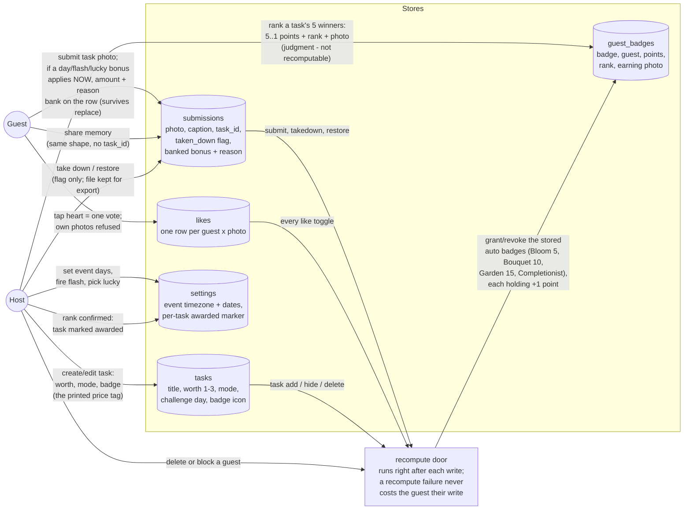
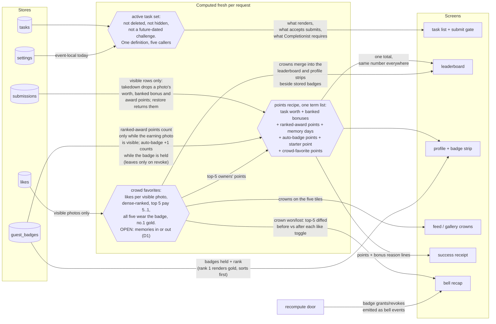
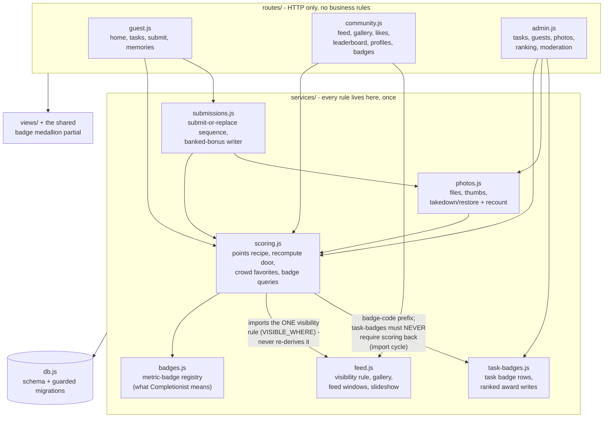
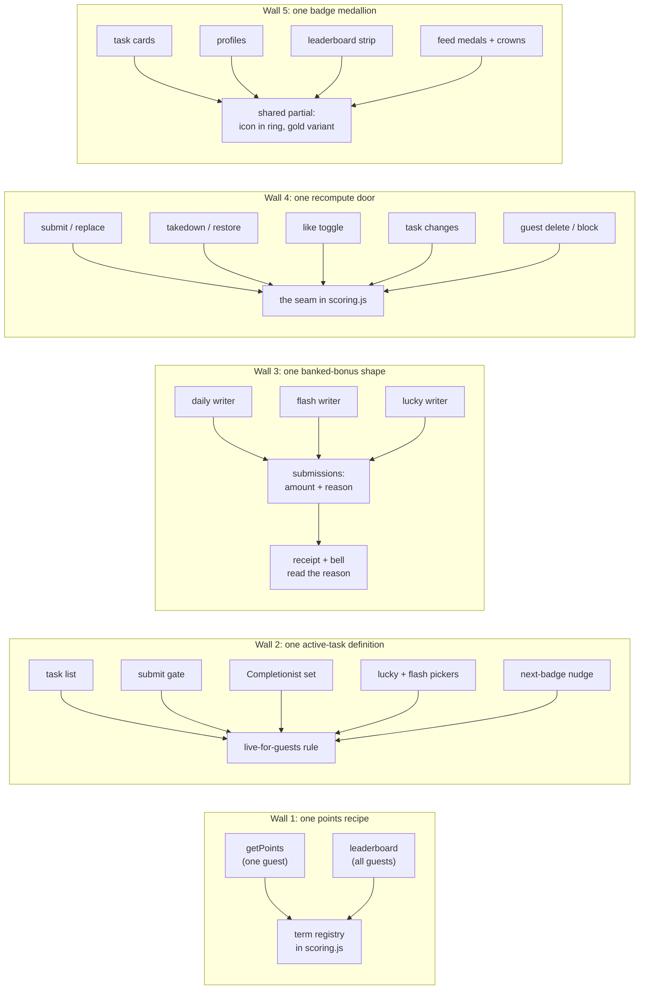

# Game Design — Points & Badges (owner-settled 2026-07-19/20)

**As any agent or contributor picking up a points/badges issue in this repo, I need the
settled game design recorded in one place, not only as comments scattered across two
dozen issues, so I build against the same picture the owner approved.**

Settled by the owner (TrevorHumble) in the 2026-07-19/20 design session and posted as a
canonical rules comment on the 24 adjacent issues on 2026-07-20. Committed to the repo by
#706. The five structural rules that keep this economy from drifting into duplicate
copies live beside this file at
[`docs/economy-architecture-2026-07-20.md`](economy-architecture-2026-07-20.md) — read
both; this file states _what_ the game does, that file states _how the code stays
single-owner_ while doing it.

---

## How guests earn points

Nine sources pay points. Each entry names the issue that builds it.

1. **Task completion pays the task's worth.** 1, 2, or 3 points, host-chosen at task
   creation, printed on the card. (#682, which absorbed #645.)
2. **Daily challenge bonus.** A daily challenge task pays an extra host-chosen 1/2/3 if
   submitted on its own day. (#624 — amends that issue's body, which originally specified
   a fixed +1.)
3. **Flash task bonus.** A flash task pays an extra host-chosen 1/2/3 during its flash
   window. (#649 — amends that issue's body, which originally specified a fixed +2.)
4. **Lucky task bonus.** The lucky task pays a secret extra host-chosen 1/2/3, revealed
   only on the success screen. (#650 — amends that issue's body, which originally
   specified a fixed +2.)
5. **First memory of the day.** The first memory (a task-free photo) a guest posts each
   event-local day pays +1. (#656.)
6. **First profile photo.** A guest's first profile photo pays +1, once ever. (Shipped,
   #409.)
7. **Automatic badges pay while held.** Every automatic badge pays +1 point for as long as
   the guest holds it. (New issue — not yet filed; do not fold this into another issue's
   scope.)
8. **Task-badge award ranking.** For each task, the host picks and ranks that task's 5
   best photos. Rank 1 pays 5, rank 2 pays 4, down to rank 5 paying 1. (#661's rewrite;
   #662 is its checklist entry point.)
9. **Crowd favorites.** Likes are votes. The 5 most-liked photos pay their owners 5/4/3/2/1
   by dense rank, derived live all weekend — a photo that drops out of the top 5 loses the
   points that came with the spot. (#625's rewrite; #651 feeds duel-generated likes into
   the same count.)

### Nothing else pays

Every point a guest sees must have a readable reason drawn from the nine sources above.
Freeform bonus points — awarded to a guest directly, or awarded to a photo outside the
nine sources — are being removed (#683 for guest-level awards, #684 for the per-photo
route). Values already awarded before removal keep counting; only the write paths for new
freeform awards die.

### Takedown and replace

- **Takedown removes a photo's points.** Restoring the photo returns them.
- **Banked bonuses survive a REPLACE, not a takedown.** The daily/flash/lucky bonus banked
  on a photo (source 2–4) carries forward if the guest replaces that photo's image, but is
  lost if the photo is taken down.

---

## How guests earn badges

- **Automatic set.** First Bloom (5 tasks), Bouquet Builder (10), Full Garden (15), and
  Completionist (every currently active task) are granted and revoked automatically as a
  guest's submissions and the active task set change — Completionist's revoke-on-task-change
  behavior is #701. Each pays +1 while held (point source 7 above).
- **Task badges.** Every task has exactly one badge, required at task creation, picked
  from the bundled icon set (#682 + #410). Completing the task does not earn the badge —
  the card copy reads "Best photo wins [badge]," prize framing, not participation framing.
  The badge goes to the host-ranked 5 best photos for that task; all five winners wear it.
- **Crowd favorite.** The top-5 most-liked photos wear the crowd-favorite badge (#625).
- **Gold rule.** In any ranked set — a task badge's 5 winners, or the crowd-favorite 5 —
  rank 1 wears the same badge rendered gold, and gold badges sort first on every display
  surface (profile, leaderboard, celebration modal). There is no separate "top" badge.
  (New issue, low priority — not yet filed.)

### One badge substrate

Two badge systems shipped historically and never met: the real badges (`badges` +
`guest_badges` tables — points-bearing, guest-visible) and the disconnected admin picker
(`badge_winners` — points-free, invisible to guests). The end state is one system: the
`badges`/`guest_badges` tables are the only badge substrate. Ranking a task's winners
releases real `guest_badges` award rows carrying both the points and the winning
submission, so takedown-revert and profile display come free from the existing model.
`badge_winners` survives at most as the picking worksheet, never as a second
points-bearing record. (Structural detail: `docs/economy-architecture-2026-07-20.md`
§ "One badge medallion.")

---

## What is dead

Do not build these, and do not preserve them when touching adjacent code.

| Killed                                                                                                                   | Why                                                                                                                                   | Owning issue                           |
| ------------------------------------------------------------------------------------------------------------------------ | ------------------------------------------------------------------------------------------------------------------------------------- | -------------------------------------- |
| MOSTPHOTOS (Most Photos badge)                                                                                           | Rewards photo spam                                                                                                                    | New removal issue — not yet filed      |
| First-to-finish bonus                                                                                                    | Rewards rushing low-effort photos                                                                                                     | #648 (closed)                          |
| The five standalone photo badges (SHUTTERBUG / CHOICE / BESTDANCE / GOLDEN / CROWDFAV in `src/services/photo-badges.js`) | Test-era placeholders that predate #410's bundled icon picker                                                                         | #661's rewrite                         |
| TOPSHOT / "Most Liked photo" badge (#490's second half)                                                                  | Absorbed by the crowd favorite                                                                                                        | Superseded by #625                     |
| MOSTLIKED (Most Liked guest badge)                                                                                       | Absorbed by the crowd favorite; the badge now rides the top-ranked photos                                                             | Superseded by #625                     |
| Badges awarded to people (the guests-page badge dropdown) and the custom-badge form                                      | A badge attaches to photos — through a task or through the crowd — never directly to a guest, except the auto set the engine computes | #683                                   |
| Freeform bonus points, guest-level and photo-level                                                                       | See "Nothing else pays" above                                                                                                         | #683 (guest-level), #684 (photo-level) |

The choose-5-winners screen that #661's rewrite keeps still exists after the placeholder
five die — it now picks winners for each task's real badge, not for the dead placeholders.

---

## Rule → issue map

- Task worth 1/2/3: #682 · Daily bonus: #624 · Flash: #649 · Lucky: #650
- Memory +1/day: #656 · Auto-badge +1: new issue, not yet filed · Gold rule: new issue, not yet filed
- Task-badge ranking + points + one-badge-system consolidation: #661 (+ #662)
- Crowd favorite (points + badge + gold): #625 · Duels feed crowd likes: #651
- Completionist recompute on task changes: #701 · Remove MOSTPHOTOS: new issue, not yet filed
- No badges/points on people: #683 · Per-photo points route removal: #684
- Reward delivery: #644 (bell) + #611 (success screen slots for bonus receipts)
- Display surfaces: #489/#490 (medals — #490's TOPSHOT half is dead), #653 (next-badge nudge), #646 (host checklist), #363 (badge art), #469 (prizes)
- #647 (Couple's Heart): the couple's gold heart is a like marker and pays nothing —
  unrelated to the gold badge rule above. Do not conflate the two golds.
- #368 (memory task card): its point mechanic is superseded by #656; only the pinned card
  placement idea remains live.
- #666 (host role): "hosts can award badges" means picking and ranking task-badge winners
  — nothing else.

---

## Open questions

These are not yet settled. Do not build against an assumed answer — check with the owner
or leave the surface generic until one of these resolves.

- **OPEN — memory eligibility for crowd favorite.** Whether memories (task-free photos)
  are eligible for crowd-favorite ranking, or only task photos are. The owner is leaning
  task-only, for anti-flooding consistency with the rest of the economy, but this is not
  yet settled.
- **OPEN — recompute triggers beyond #701.** The exact recompute triggers for badge
  staleness beyond #701's task-change seam — for example guest delete or block — are not
  fully enumerated.
- **OPEN — gold-sorts-first surface list.** Which specific display surfaces the
  gold-sorts-first rule enumerates has not been itemized beyond the examples above
  (profile, leaderboard, celebration modal).

---

## Data flow and architecture

### Data-flow diagrams — the settled points/badges economy (2026-07-20)

Companion to `docs/game-design-points-badges.md` (what the game does) and
`docs/economy-architecture-2026-07-20.md` (the five single-owner rules).
Diagram 1: what gets WRITTEN, when, and why it is stored at all.
Diagram 2: what is DERIVED fresh on every read, and why it is never stored.

#### 1. Write paths

Only facts and judgments are stored — things no query could recompute. Every write that
can move badge state passes the recompute door on its way out.

Why the door exists: auto badges are the ONE thing still stored that a mutation can
invalidate. Everything that mutates their inputs is on the door's list — miss one and a
badge sits stale until an unrelated event heals it (the #701 bug class).

#### 2. Read paths

Nothing here is ever stored. A stored copy could go stale the moment its inputs move;
a computed answer cannot.

The split in one line: stores hold what happened and what the host decided; the derived
layer holds math. Facts need the recompute door to keep the stored auto badges honest.
Math cannot rot.

#### 3. Module architecture — where the code lives

Routes never touch scoring math or SQL of their own; they call services. Services own
their rules exactly once. The db layer holds schema and migrations only.

Principal dependencies shown; routes also call photos/submissions/task-badges helpers
directly for uploads and file handling. The two labeled edges are the load-bearing ones:
`scoring -> task-badges` must never gain a reverse import (module-load cycle, warned in
task-badges.js itself), and visibility is owned by feed.js — scoring imports it, nothing
re-types it.

#### 4. The five single-owner walls

Each rule has exactly one owner; every consumer calls it. A second hand-written copy of
any of these, anywhere, is a defect — not a style choice. Full rationale:
`docs/economy-architecture-2026-07-20.md`.

